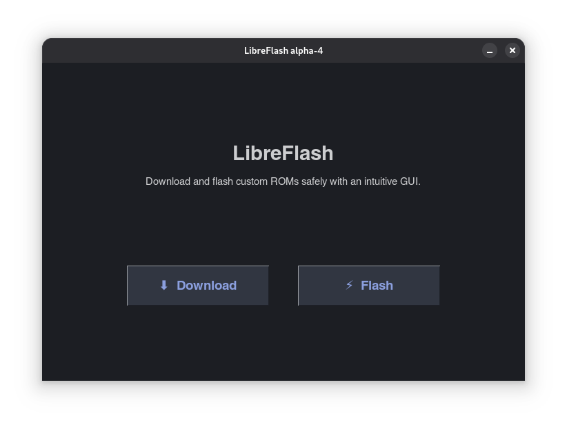
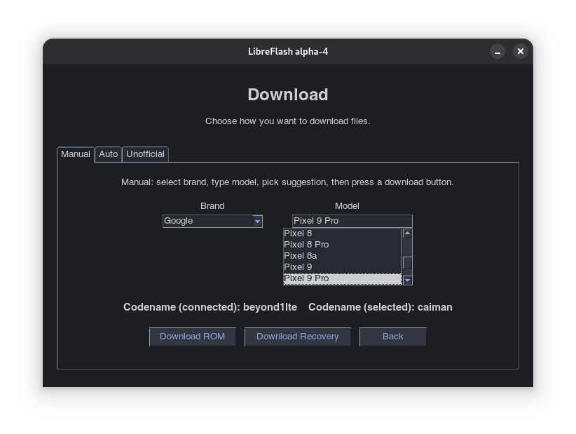
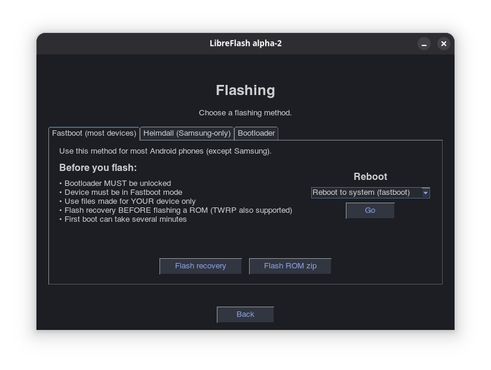

# LibreFlash
<p align="center">
  
  
  
</p>

LibreFlash is a simple Linux application that helps you download and flash Android ROMs without having to memorize command-line tools.

It uses familiar tools like `adb`, `fastboot`, and `heimdall` in the background, but presents them in a clear interface that shows exactly what is happening.

This project is currently **alpha software**. Most features work, but rough edges are expected.

---

## What LibreFlash can do

### Download files

* Download official LineageOS ROM ZIPs and recoveries for many devices
  (the list is still growing and does not include every officially supported device yet)

### Flash files

* Flash recovery or boot images using:

  * Fastboot (most devices)
  * Heimdall (Samsung devices)
* Install ROM ZIPs using ADB sideload

Flashing works for **all devices**, official or unofficial, as long as the correct files are provided.
The device list only affects downloading, not flashing.

### Device tools

* Reboot to system, recovery, fastboot, or download mode
* Check, unlock, or lock the bootloader on fastboot devices
* View live command output so nothing happens silently
* Built-in safety checks to prevent flashing unsupported image types

---

## Supported systems

* Linux only (Alpha)
* macOS planned for a future beta
* Windows is not supported (community ports welcome)

---

## Requirements

LibreFlash does not bundle Android tools. They must be installed system-wide.

Required:

* adb
* fastboot
* pkexec

Optional:

* heimdall (required for Samsung devices)

---

## How to use LibreFlash

```bash
chmod +x LibreFlash-*.AppImage
./LibreFlash-*.AppImage
```

Choose Download or Flash and follow the on-screen instructions.
Make sure your device is in the correct mode before starting an action.

LibreFlash does not automatically detect device state.
If something goes wrong, the underlying tools will report the reason.

---

## Safety and responsibility

Flashing Android devices always involves risk.

* Unlocking the bootloader usually wipes all user data
* Flashing incorrect files can permanently damage a device
* Locking the bootloader with modified software can brick devices

You are responsible for the actions you take.
LibreFlash is provided as-is, without warranty of any kind.

---

## Project status

* Version: v0.0.1-alpha1
* Device download list is incomplete
* Flashing works for all devices if correct files are supplied

Planned features:

* Magisk installer via ADB sideload
* Expanded device list for downloads
* Device status panel
* macOS support

---

## License

LibreFlash is Free and Open Source Software.
License: GPL v2

---

## Legal notice

LibreFlash is not affiliated with Google, LineageOS, or any device manufacturer.
Android is a trademark of Google LLC.
